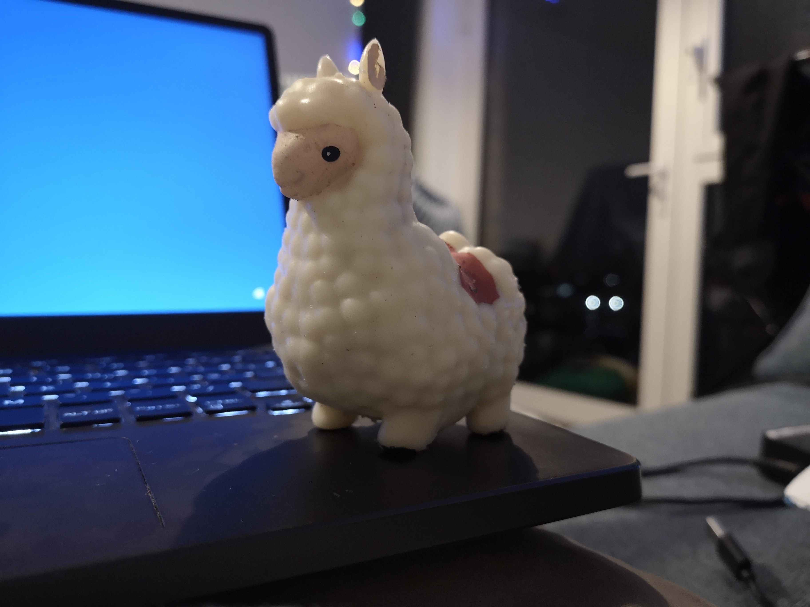
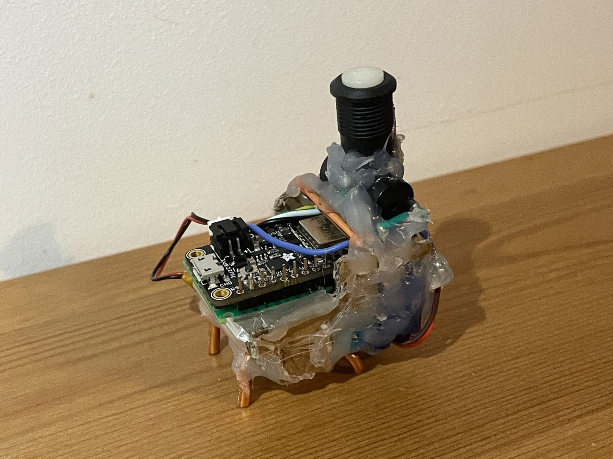
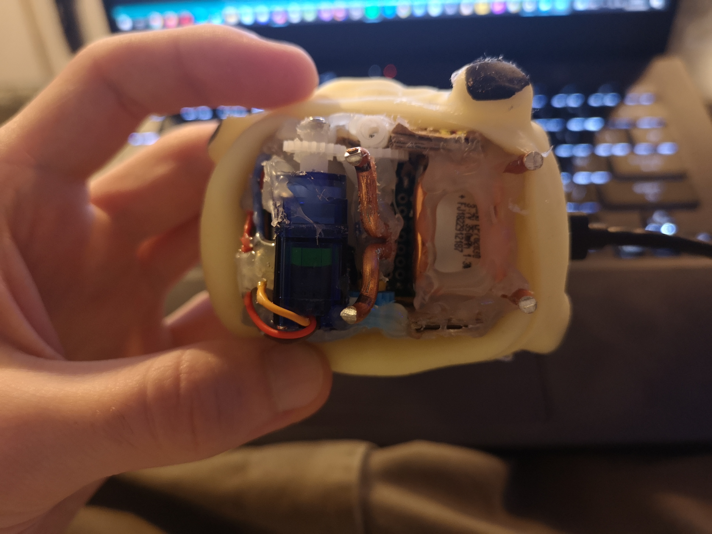
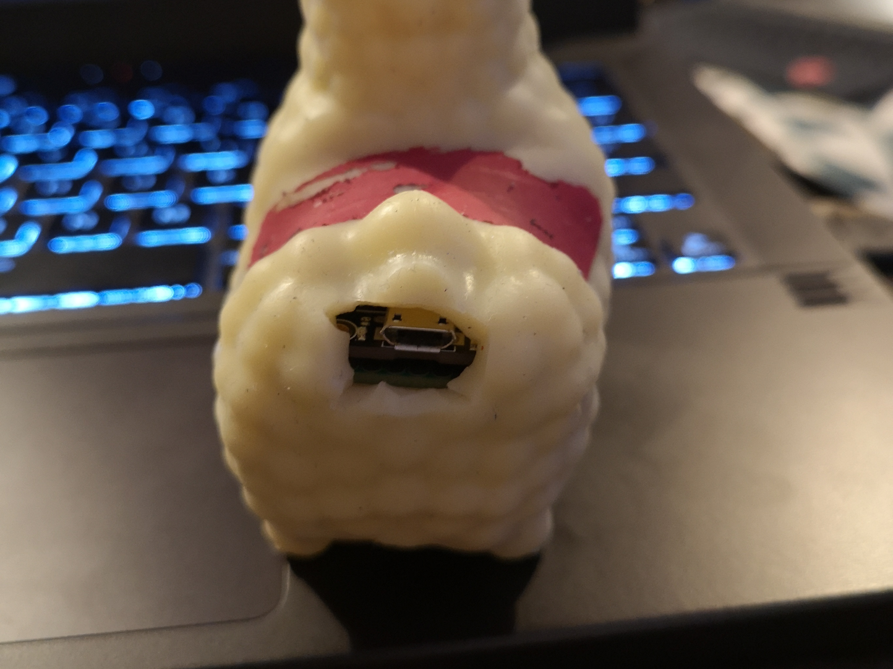

# Llama Bot

For this project, I've converted a bursted [Calma LLama](https://www.amazon.com/-/es/Boxer-Gifts-Calma-Llama-anti-estr%C3%A9s/dp/B079TPCD5X) stress toy into a singing, dancing cyborg. The final product includes an On/Off button, a reptoire of 10 songs and a 350mAH LiPo battery which can be recharged via a micro-usb port on the rear.

The toy is driven by an Adafruit Feather HUZZAH ESP8266 development board with onboard WiFi module which, although not utilised at the moment, opens up future potential control over WiFi.

To counter the lack of multi-threading support on the feather, I've used protothreading to achieve simultaneous singing and dancing.

The robot's On/Off button acts as a switch grounding the ESP8266 chip's enable pin allowing a current draw of 0 while turned off.